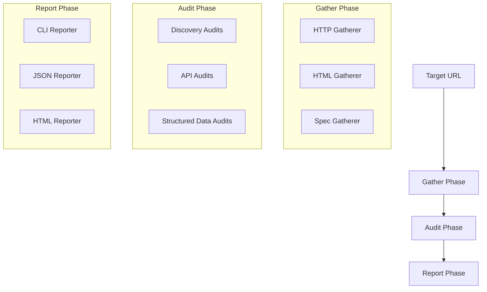

# ax-score Architecture

This document describes the internal architecture of ax-score and how its components interact to produce an AX score.

## System Overview

ax-score follows a modular, pipeline-based architecture inspired by Google Lighthouse.

## Core Components

### 1. BaseGatherer

Gatherers are responsible for collecting raw data from the target. They do not perform any analysis.

- **Input**: Target URL and configuration.
- **Output**: Artifacts (e.g., response headers, file contents, parsed DOM).

### 2. BaseAudit

Audits analyze the artifacts produced by gatherers to determine a score and provide diagnostic information.

- **Input**: Artifacts from gatherers.
- **Output**: Audit result (score 0-1, description, suggestions).

### 3. Scoring Engine

The scoring engine aggregates individual audit results into categories and calculates the overall score.

- **Algorithm**: Weighted arithmetic mean.
- **Weights**: Defined in the configuration for each category and audit.

### 4. Reporter

Reporters format the aggregated results for different output targets.

- **CLI**: Human-readable terminal output with colors and spinners.
- **JSON**: Machine-readable format for CI/CD and integration.
- **HTML**: (Future) Visual report for web browsers.

## How to Add a New Audit

1. **Define the Requirement**: Determine what data is needed and what the scoring criteria are.
2. **Create a Gatherer**: If the data isn't already collected, create a new gatherer in `src/gatherers/`.
3. **Implement the Audit**: Create a new class in `src/audits/` extending `BaseAudit`. Implement the `audit()` method.
4. **Register in Config**: Add the audit reference and its weight to `src/config/default-config.ts`.
5. **Verify**: Run the CLI against a test site to ensure the audit executes and scores correctly.

## Scoring Algorithm

The overall score is calculated as follows:

1. Each audit produces a score between `0` and `1`.
2. Within a category, the category score is the weighted average of its audits:
   `CategoryScore = Σ(AuditScore * AuditWeight) / Σ(AuditWeight)`
3. The overall score is the weighted average of the category scores:
   `OverallScore = Σ(CategoryScore * CategoryWeight) / Σ(CategoryWeight)`

## Category Weights

| Category          | Weight |
| ----------------- | ------ |
| Discovery         | 25     |
| API Quality       | 25     |
| Structured Data   | 20     |
| Auth & Onboarding | 15     |
| Error Handling    | 10     |
| Documentation     | 5      |

## Integration Patterns

- **CLI**: Direct usage by developers in the terminal.
- **Programmatic**: Importing `runAudit` into other TypeScript/JavaScript projects.
- **CI/CD**: Running ax-score in a GitHub Action or GitLab CI to prevent AX regressions.
- **Web Service**: (Future) A REST API that runs ax-score on demand.
